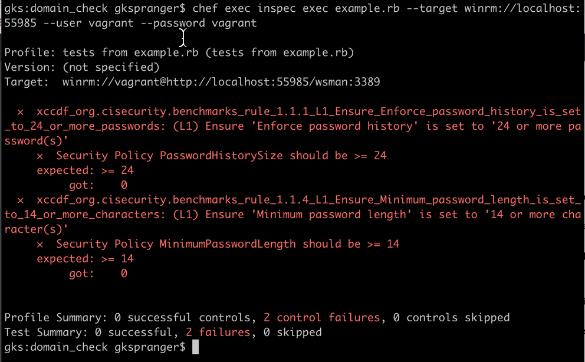

## Windows 2012 R2 Benchmark
### As Defined by the Center for Internet Security
- https://www.cisecurity.org/wp-content/uploads/2017/04/CIS_Microsoft_Windows_Server_2012_R2_Benchmark_v2.2.0.pdf

#### Rule 1.1.1 L1
##### Enforce password history is set to 24 or more passwords
```ruby
# the code
describe security_policy do
  its("PasswordHistorySize") { should be >= 24 }
end
```

#### Rule 1.1.4 L1
##### Minimum password length is set to 14 or more characters
```ruby
# the code
describe security_policy do
  its("MinimumPasswordLength") { should be >= 14 }
end
```

If you look at the example.rb file, you will see I am checking for these 2 rules .. I then run the command below from my laptop:

```bash
# target == the node you want to test and what port WinRM is running on

chef exec inspec exec example.rb \
--target winrm://localhost:55985 \
--user vagrant \
--password vagrant
```

As you can see, the node I am testing has failed these 2 rules, which can help define priority work .. When you are ready, I can show you how to use Chef Infra to correct the security vulnerability ..

*IMAGINE BEING ABLE TO* scan your entire infrastructure based on codified "rules" you care about, in an automated fashion .. Benefits are:
- A common (re-usable) language to define security and compliance rules
- Reduced time to vulnerability detection
- Increased visibility into security vulnerabilities
- Decreased time spent auditing infrastructure


